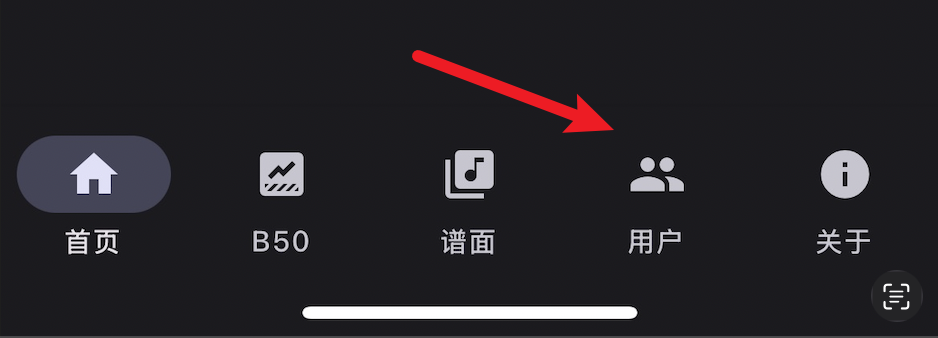
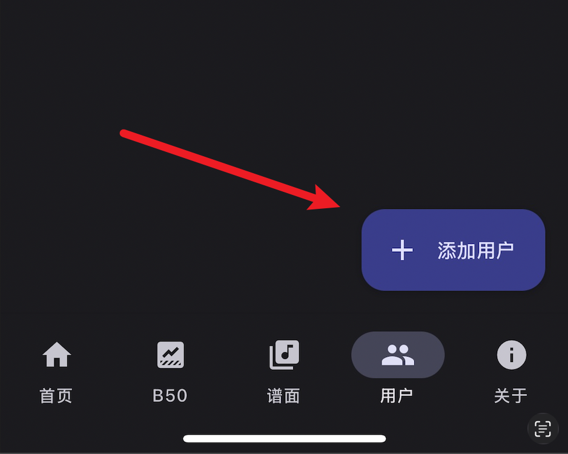
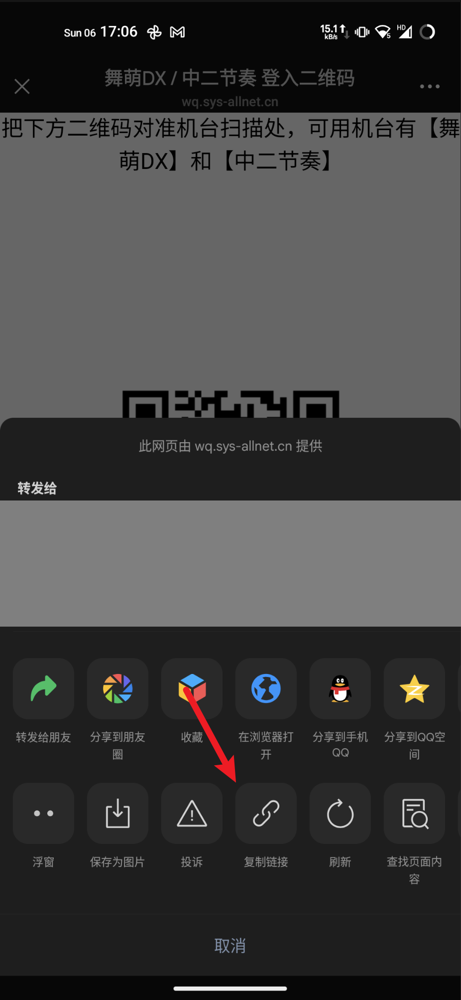
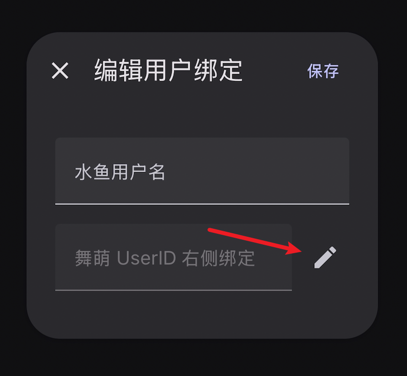
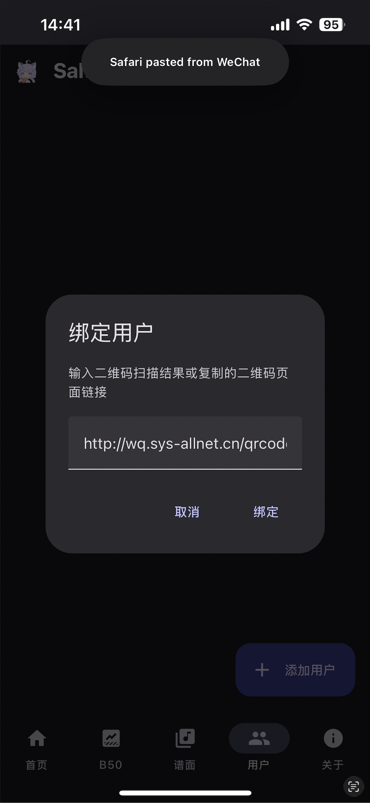
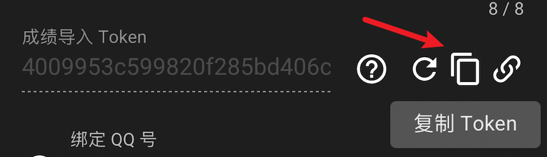
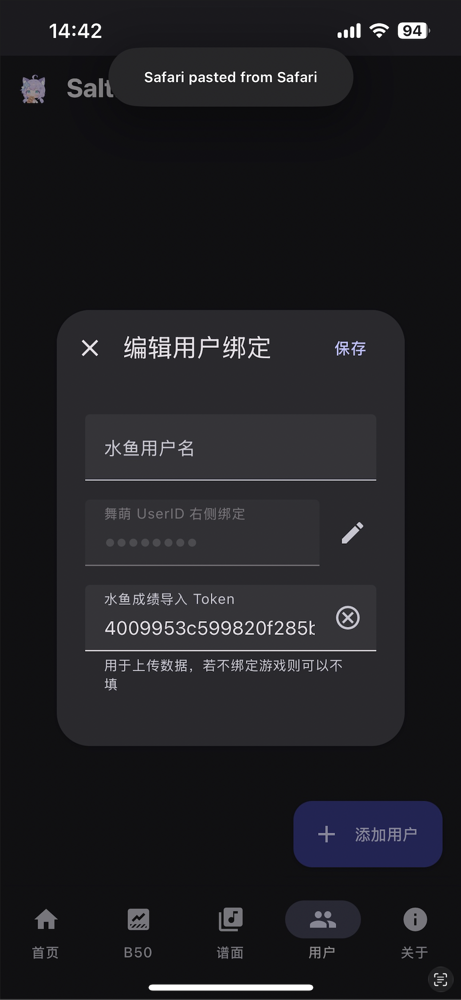
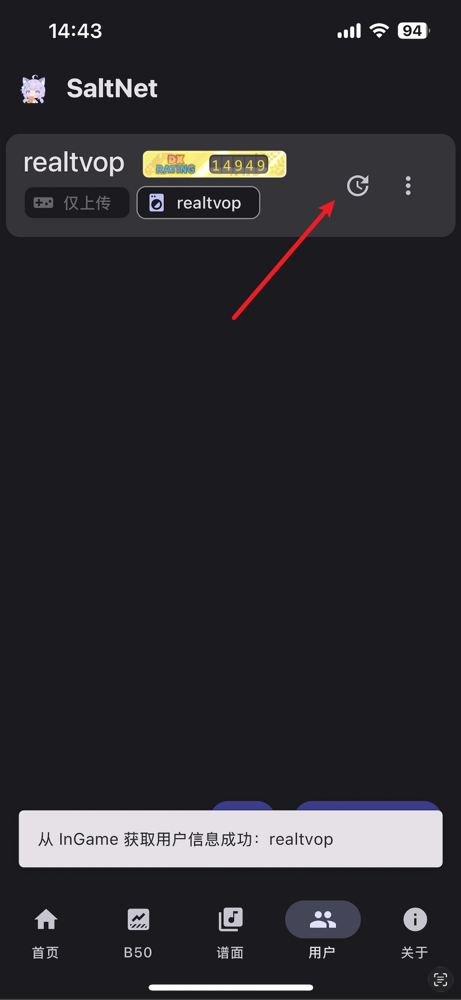

# 绑定用户并更新成绩

## 新建用户

打开用户管理页面，点击**添加用户**按钮。

## 绑定账号

在 `舞萌｜中二` 公众号中获取登录二维码，打开，点击右上角三个点展开菜单，点击复制链接。

回到 SaltNet，点击对话框中的铅笔按钮，在弹出窗口中粘贴链接，点击`绑定`。

!!! danger "警告"

    请务必妥善保管好你的二维码信息，在二维码有效期内**任何人**都能通过它访问你的舞萌游戏账号，如需转发请确保发送对象的人 / 机器人当且仅当是你**完全信任**且**知根知底**的人 / 机器人。

## 绑定水鱼（非必要，如需上传成绩请执行）

!!! tip "提示"

    上传到水鱼有利于使用各大 bot 的功能，建议绑定

打开 [水鱼查分器](https://www.diving-fish.com/maimaidx/prober/)，注册登录后点击 `编辑个人资料`，在弹出窗口中复制 `成绩导入 Token`。

!!! question "提示"

    如未显示 `成绩导入 Token`，请点击复制左边的按钮生成并在复制后点击右下方保存。

回到 SaltNet，将获取到的 `成绩导入 Token` 粘贴到 `水鱼成绩导入 Token` 中。

## 保存并同步成绩

点击`保存`按钮，随后点击那个长得像历史记录图标的成绩更新按钮即可同步成绩。

