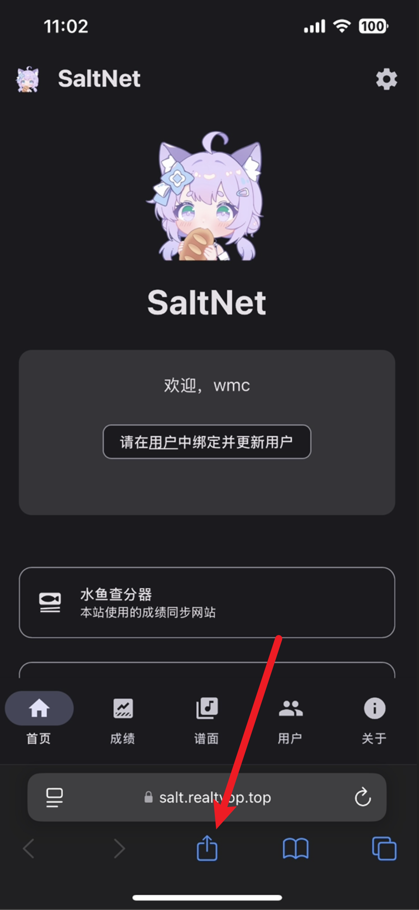
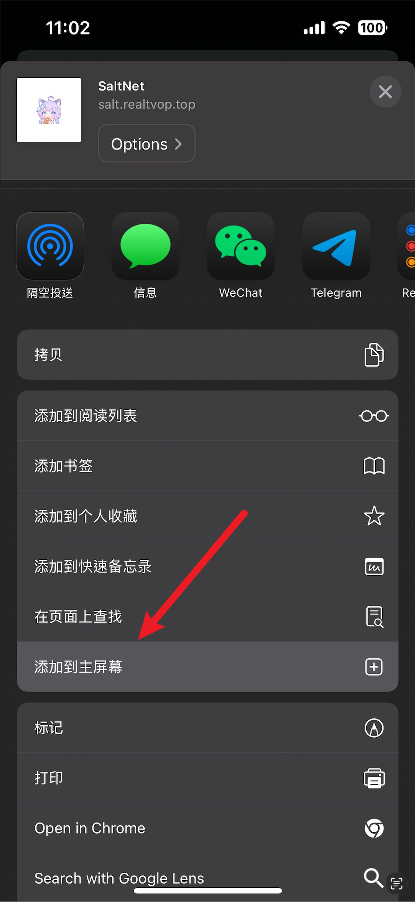
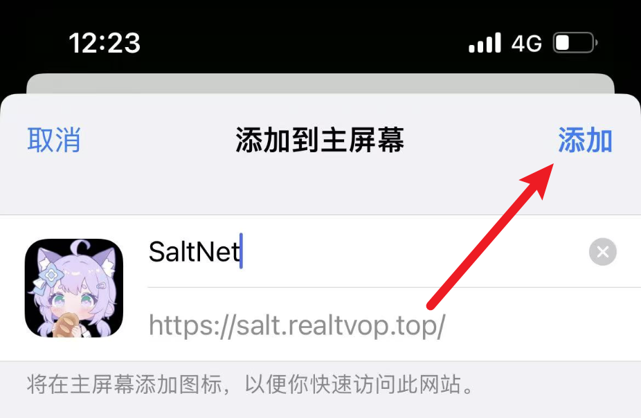
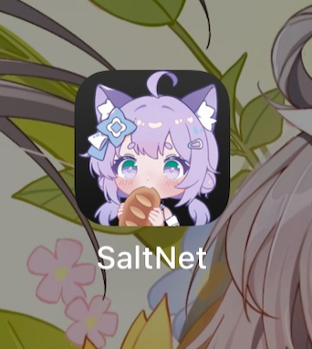
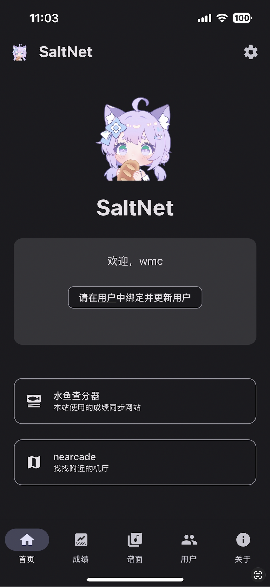
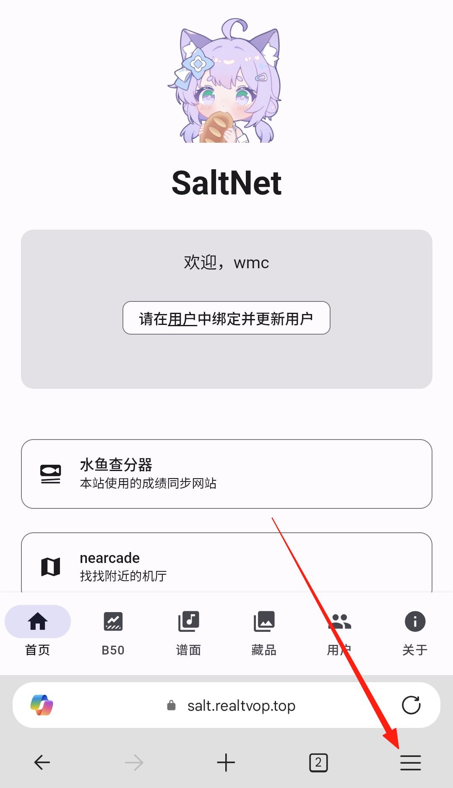
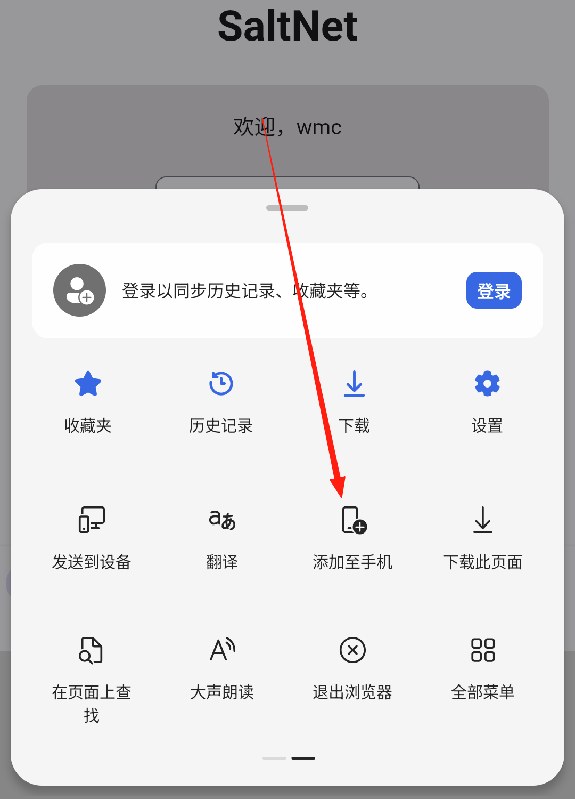
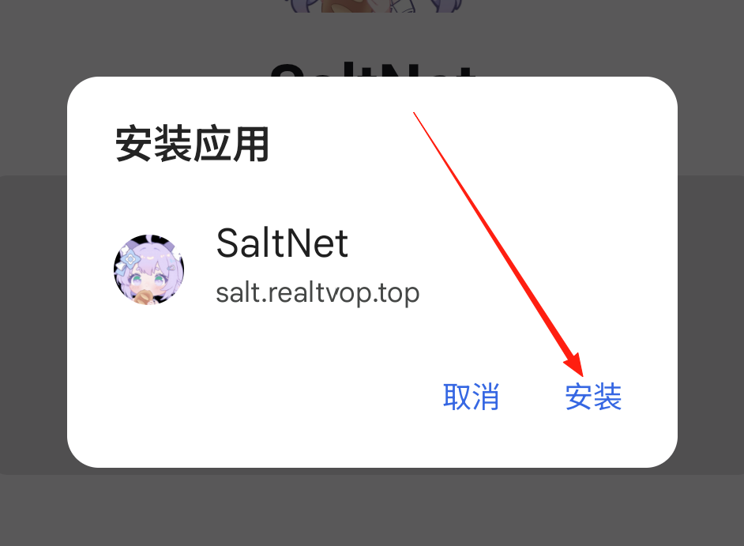

# 将 SaltNet 作为应用安装

## iPhone / iPad

> iOS / iPadOS 用户请先安装 PWA 应用，因为在浏览器里设置好后再安装不会同步数据！

首先在 **Safari** 中打开 [SaltNet](https://salt.realtvop.top)，点击分享按钮。

然后选择“添加到主屏幕”。

最后点击“添加”即可。

回到主屏幕，你会看到 SaltNet 的图标，你可以将这个图标移动到任何位置。
> ！重要：长按图标并选择“删除书签”会删除所有数据！！！

点击即可打开。

## 安卓

> 大部分主流浏览器（建议使用[Edge](https://www.microsoft.com/en-us/edge/mobile)，[Google Chrome](https://www.google.com/chrome/)等浏览器）均支持安装 PWA ，以下为已知的可能不支持此功能的浏览器：

| 浏览器 | 版本 |
|-------|-------|
| UC浏览器 | （过旧版本，现已支持） |
| QQ浏览器 | （过旧版本，现已支持） |
| Firefox | （部分版本，火狐本身对PWA的支持较弱） |

首先在浏览器中打开 [SaltNet](https://salt.realtvop.top) 页面，点击浏览器 **更多** 按钮（一般为三条横杠）。

然后选择“添加到手机”/“添加到主屏幕”/“安装到手机”或类似选项。

最后可自定义将要安装的 PWA 应用的名称，点击“添加”/“安装”即可。

回到主屏幕，你会看到显示着你自定名称（默认为SaltNet）的 SaltNet 的图标，你可以将这个图标移动到任何位置，点击即可打开并正常导入、保存数据。

## 电脑